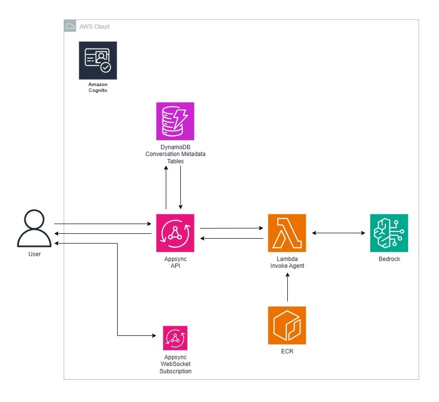

# Serverless Chatbot AWS

A production-ready serverless chatbot application built on AWS infrastructure, leveraging modern cloud-native technologies for scalable conversational AI experiences.



## Overview

This project implements a fully serverless chatbot solution using AWS services, designed for high availability, scalability, and cost-effectiveness. The architecture combines real-time GraphQL subscriptions, AI-powered conversations through Amazon Bedrock, and robust user authentication.

## Architecture Components

### Core Services

- **AWS AppSync**: GraphQL API with real-time subscriptions for bidirectional communication
- **Amazon Bedrock**: AI foundation models (Nova, Claude, Titan) for natural language processing
- **AWS Lambda**: Serverless compute for orchestrating chat workflows
- **Amazon DynamoDB**: NoSQL database for users, chats, and messages storage
- **Amazon Cognito**: User authentication and authorization
- **Amazon ECR**: Container registry for Lambda function images
- **Amazon CloudWatch**: Logging and monitoring

### Infrastructure as Code

- **Terraform**: Complete infrastructure provisioning with modular architecture
- **Docker**: Containerized Lambda functions for consistent deployments

## Features

### Core Functionality

- **Multi-user Chat Management**: Create, list, and delete chat sessions
- **Real-time Messaging**: Bi-directional communication with WebSocket subscriptions
- **AI-Powered Responses**: Integration with multiple Bedrock models
- **Message History**: Persistent conversation storage and retrieval
- **User Authentication**: Secure access via Cognito user pools

### Technical Capabilities

- **Multiple Authentication Methods**: API Key, Cognito User Pools, AWS IAM
- **Scalable Database Design**: Optimized DynamoDB schema with GSI for efficient queries
- **Containerized Lambda**: Docker-based deployments for better dependency management
- **Real-time Subscriptions**: GraphQL subscriptions for instant message delivery
- **Cross-Model Support**: Compatible with Amazon Nova, Anthropic Claude, and Amazon Titan

## Technology Stack

### Backend
- **Runtime**: Python 3.12
- **GraphQL**: AWS AppSync with JavaScript resolvers
- **Database**: Amazon DynamoDB with composite keys
- **AI Models**: Amazon Bedrock (Nova Micro, Claude, Titan)
- **Authentication**: Amazon Cognito

### Infrastructure
- **IaC**: Terraform with modular design
- **Containerization**: Docker for Lambda packaging
- **Monitoring**: CloudWatch logs and metrics
- **CI/CD**: ECR for container management

### Development Tools
- **Testing Scripts**: Node.js GraphQL clients for API testing
- **Build Automation**: Makefile for Terraform operations
- **Environment Management**: Python virtual environments

## Project Structure

```
├── infra/                          # Infrastructure components
│   ├── terraform/                  # Terraform modules and configuration
│   │   ├── modules/               # Reusable Terraform modules
│   │   │   ├── appsync/           # GraphQL API configuration
│   │   │   ├── cognito/           # User authentication
│   │   │   ├── dynamodb/          # Database tables
│   │   │   ├── lambda/            # Serverless functions
│   │   │   ├── iam/               # Access control policies
│   │   │   ├── ecr/               # Container registry
│   │   │   └── cloudwatch/        # Monitoring setup
│   │   ├── main.tf                # Root Terraform configuration
│   │   ├── variables.tf           # Input variables
│   │   └── outputs.tf             # Output values
│   ├── lambdas/                   # Lambda function source code
│   │   └── orchestrator/          # Main chat orchestration function
│   │       ├── app.py             # Python handler
│   │       ├── Dockerfile         # Container configuration
│   │       └── requirements.txt   # Python dependencies
│   └── graphql/                   # GraphQL schema definition
│       └── schema.graphql         # API schema
├── scripts/                       # Development and testing utilities
│   ├── create-user.js            # User creation script
│   ├── create-chat.js            # Chat creation script
│   ├── send.js                   # Message sending script
│   ├── subscribe.js              # Real-time subscription test
│   └── list-messages.js          # Message retrieval script
├── frontend/                     # Frontend application directory
├── Makefile                      # Build automation
└── requirements.txt              # Python dependencies for local development
```

## Database Schema

### Tables

**Users Table**
- Primary Key: `id` (String)
- Attributes: `name`, `email`, `createdAt`

**Chats Table**
- Primary Key: `id` (String)
- GSI: `userId-createdAt` for user chat listings
- Attributes: `userId`, `title`, `createdAt`

**Messages Table**
- Composite Key: `chatId` (PK), `sk` (SK) - format: `timestamp#messageId`
- Attributes: `id`, `userId`, `role`, `content`, `createdAt`

## API Schema

### GraphQL Operations

**Queries**
- `me`: Get current user information
- `listChatsByUser`: Retrieve user's chat sessions
- `listMessages`: Get chat message history

**Mutations**
- `createUser`: User registration
- `createChat`: Create new chat session
- `sendMessage`: Send user message and trigger AI response
- `addAssistantMessage`: Add AI-generated response
- `deleteChat`: Remove chat session

**Subscriptions**
- `onMessageSent`: Real-time message updates

## Deployment

### Prerequisites

- AWS CLI configured with appropriate permissions
- Terraform >= 1.5.0
- Docker installed
- Python 3.12+
- Node.js (for testing scripts)

### Infrastructure Deployment

1. **Initialize Terraform**
   ```bash
   make init
   ```

2. **Plan Infrastructure**
   ```bash
   make plan
   ```

3. **Deploy Resources**
   ```bash
   make apply
   ```

4. **Destroy Infrastructure**
   ```bash
   make destroy
   ```

### Configuration Variables

Key Terraform variables:
- `region`: AWS deployment region (default: us-east-1)
- `project_name`: Resource naming prefix (default: chatbot)
- `bedrock_model`: AI model selection (default: amazon.nova-micro-v1:0)
- `callback_urls`: Cognito authentication callbacks
- `logout_urls`: Cognito logout redirects

## Development

### Local Testing

The `scripts/` directory contains Node.js utilities for API testing:

- **User Management**: Create and authenticate users
- **Chat Operations**: Create chats and send messages
- **Real-time Testing**: Subscribe to message updates
- **Message Retrieval**: Query conversation history

### Environment Setup

1. Configure environment variables from Terraform outputs
2. Install dependencies: `npm install` in scripts directory
3. Run test scripts with appropriate environment variables

## Security

### Authentication Methods

- **API Key**: For development and testing
- **Cognito User Pools**: Production user authentication
- **AWS IAM**: Service-to-service authentication

### Access Control

- IAM roles with least-privilege access
- AppSync authorization directives
- VPC endpoints for enhanced security (optional)

## Monitoring

### CloudWatch Integration

- API request/response logging
- Lambda function metrics
- DynamoDB performance monitoring
- Real-time error tracking

### Key Metrics

- API latency and throughput
- Lambda cold start times
- DynamoDB read/write capacity
- Bedrock model invocation costs

## Cost Optimization

### Serverless Benefits

- Pay-per-use pricing model
- Automatic scaling with demand
- No infrastructure maintenance overhead
- Optimized resource allocation

### Performance Considerations

- DynamoDB on-demand billing
- Lambda memory optimization
- AppSync caching strategies
- Bedrock model selection based on use case